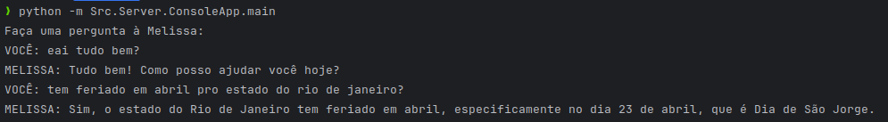

# Melissa - Assistente Virtual empoderada por IA

## Para rodar o projeto
### Requisitos
- Necessário ter o Python 3.10 ou superior instalado.
- Necessário ter o pip instalado.
- Necessário ter o Ollama rodando.
- Necessário ter uma api_key do [Invertexto](https://api.invertexto.com/).

### Instalação rápida do Ollama (Docker)

```bash
sudo docker run -d -v ollama:/root/.ollama -p 11434:11434 --name ollama ollama/ollama
ollama pull llama3.1
```

Para mais opções de instalação, acesse: https://ollama.com/

### Instalação das dependências

```bash
pip install -r requirements.txt
```

### Criando arquivo .env
```bash
cp Src/Server/.env.example Src/Server/.env
```

Informe a api_key do Invertexto no arquivo .env

### Rodando o projeto no console
```bash
python python -m Src.Server.ConsoleApp.main
```



## Referências
- https://www.treinaweb.com.br/blog/consumindo-apis-com-python-parte-1
- https://github.com/msamylea/Llama3_Function_Calling/blob/main/app.py
- https://sacha-schwab.medium.com/3-ways-to-run-llama-3-2-locally-79bfaf161669

